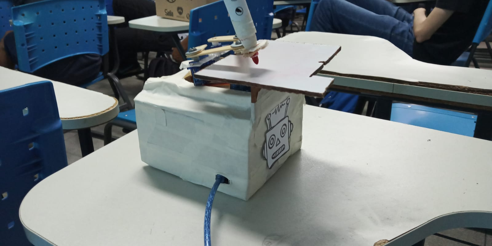
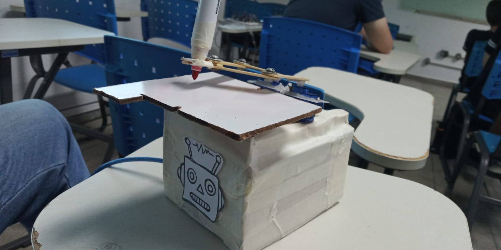
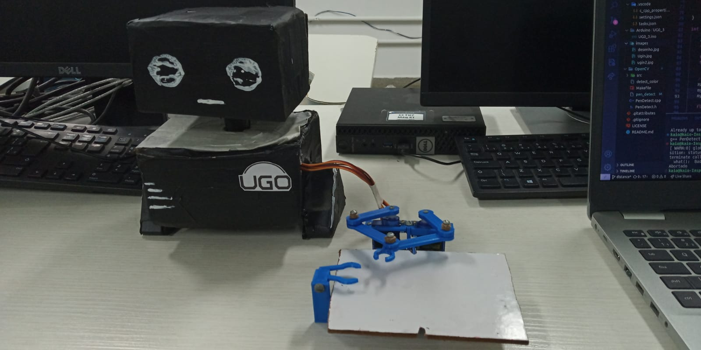

# UG0
 Robô feito com Arduino, com proposta de implementação na robótica educacional devido sua interdisciplinaridade com a matemática (com funcionamento totalmente baseado em movimentação com ângulos e plano cartesiano)

 <h3>Materiais usados:</h3> 
 <ul>
   <li>3 Servos</li>
   <li>1 Protoboard</li>
   <li>1 Arduino Uno</li>
 </ul>
 
  
 
 

 

  
  <h6> Funcionamento: <a href="https://www.youtube.com/shorts/5RN0mQ5cIJ4">Video</a></h6>

 Participantes:  <a href= "https://github.com/Franky03"> Frankley Kaiky </a>, <a href= "https://github.com/MatheusFelipeLS"> Matheus Felipe </a>,<a href= "https://github.com/kaiocesarb15"> Kaio César </a>, <a href= "https://github.com/GabriellyMarques02"> Thaís Gabrielly </a> e <a href="https://github.com/CamillyQueziz">Camilly Queziz</a>.

 # UGO 2.0
  Foi usado para implementar algoritmo de visão computacional com OpenCV em C++ com o objetivo de desenhar seguindo o lápis capturado pela câmera.
  Nessa versão a estrutura que desenha foi substituida por peças em impressão 3D e foi feito um corpo ilustrativo para o robô.
  
  

   
 

 
 Participantes:  <a href= "https://github.com/Franky03"> Frankley Kaiky </a>, <a href= "https://github.com/MatheusFelipeLS"> Matheus Felipe </a>,<a href= "https://github.com/kaiocesarb15"> Kaio César </a>
