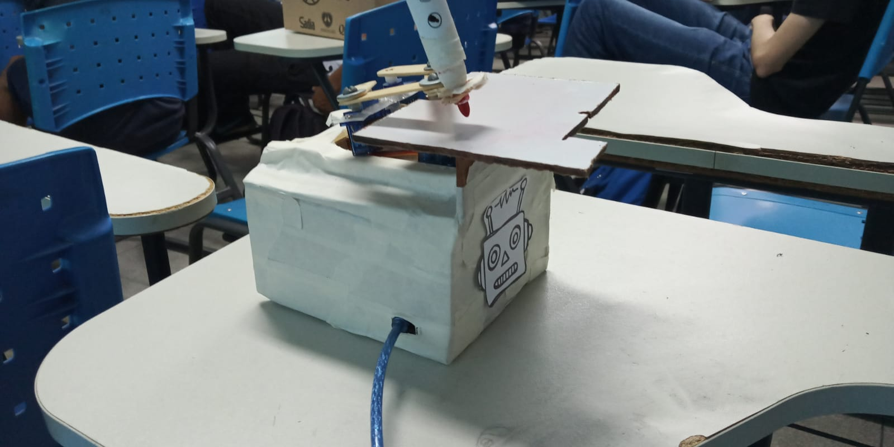
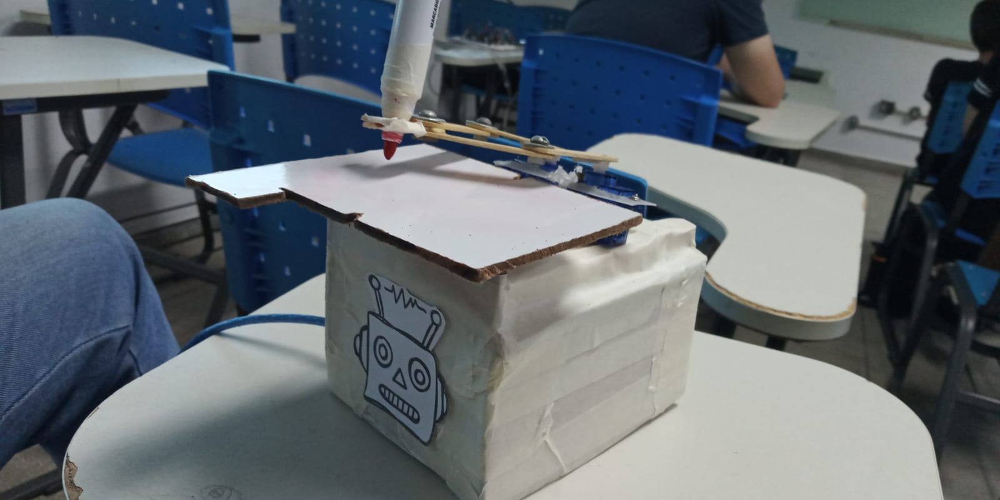

# UG0
 Robô feito com Arduino, com proposta de implementação na robótica educacional devido sua interdisciplinaridade com a matemática (com funcionamento totalmente baseado em movimentação com ângulos e plano cartesiano)

 <h3>Materiais usados:</h3> 
 <ul>
   <li>3 Servos</li>
   <li>1 Protoboard</li>
   <li>1 Arduino Uno</li>
 </ul>
 
  
 
 

 

  
  <h6> Funcionamento: <a href="https://www.youtube.com/shorts/5RN0mQ5cIJ4">Video</a></h6>
 
 <h4>Trabalhos Futuros:</h4>
  <ul>
   <li>Fazer o robô desenhar uma imagem passada.</li>
   <li>Uso de IA para criação de imagens a partir de um prompt, em seguida desenhada pelo robô.</li>
 </ul>
 
 Participantes:  <a href= "https://github.com/Franky03"> Frankley Kaiky </a>, <a href= "https://github.com/MatheusFelipeLS"> Matheus Felipe </a>,<a href= "https://github.com/kaiocesarb15"> Kaio César </a>, <a href= "https://github.com/GabriellyMarques02"> Thaís Gabrielly </a> e Camilly Queziz.
